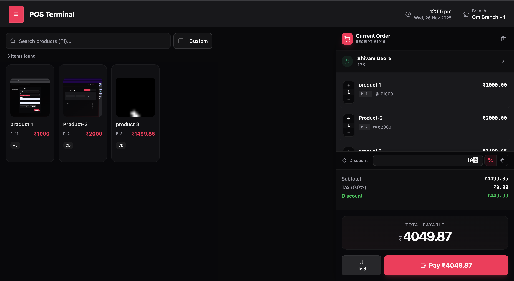
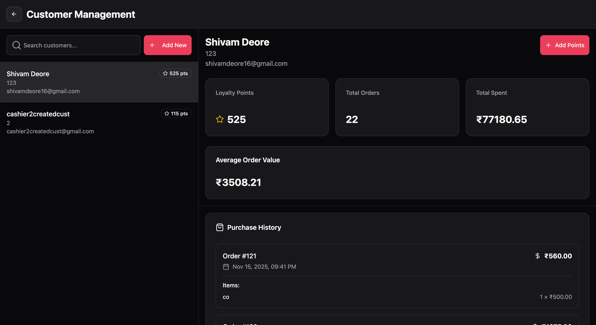
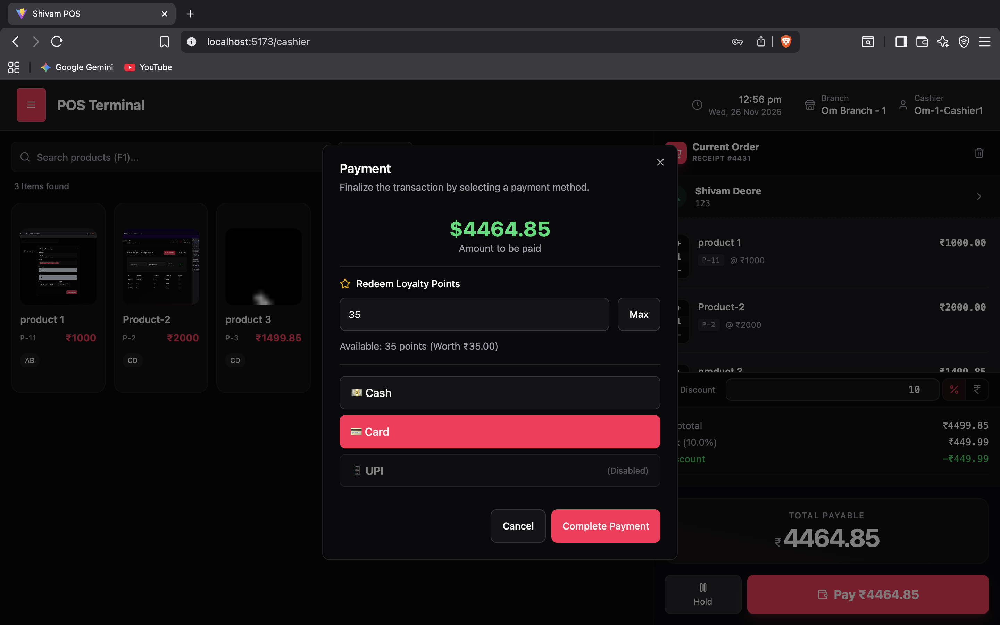
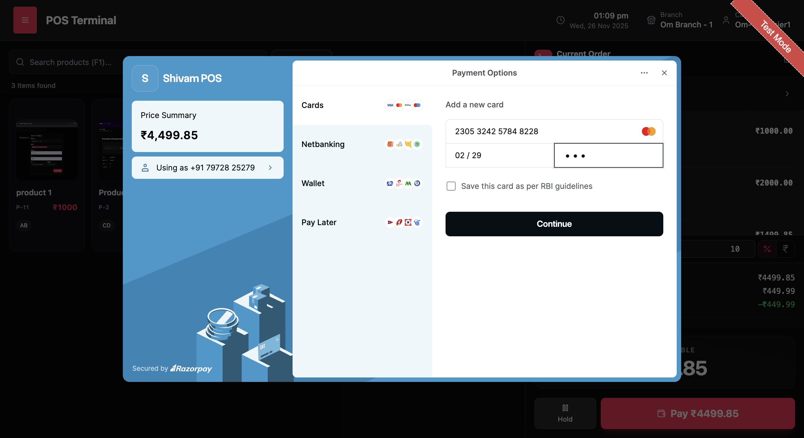
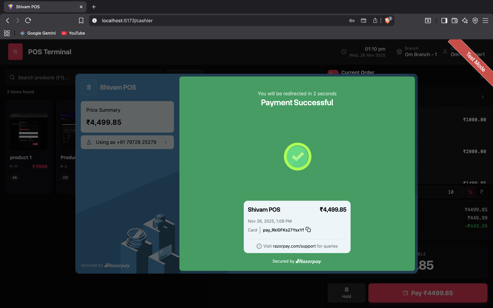
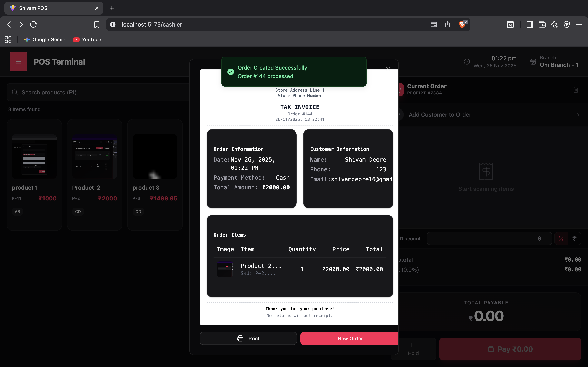
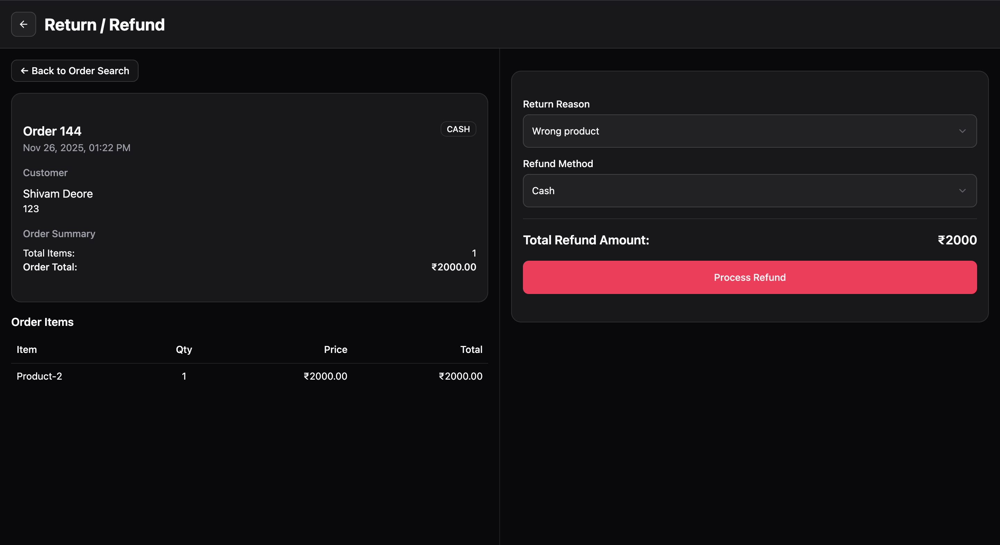
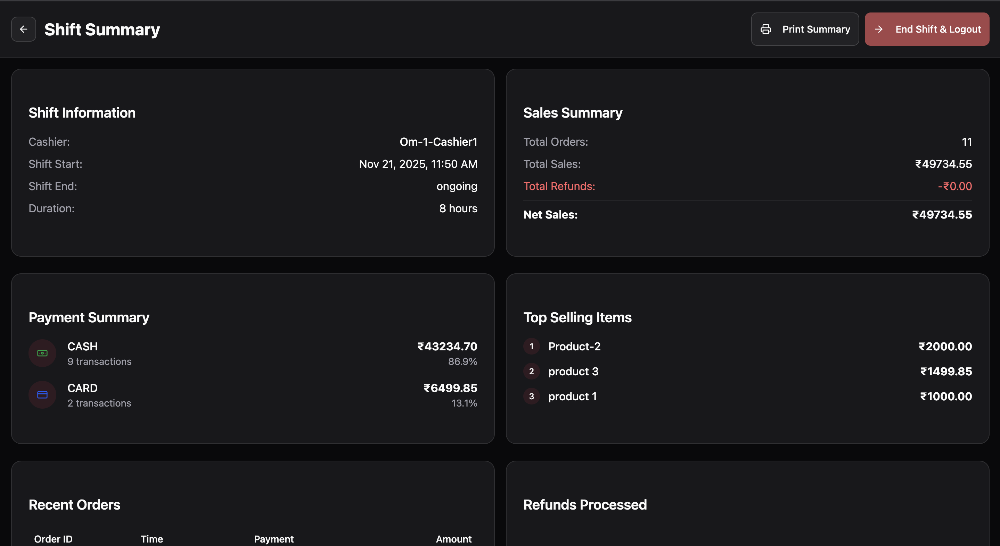
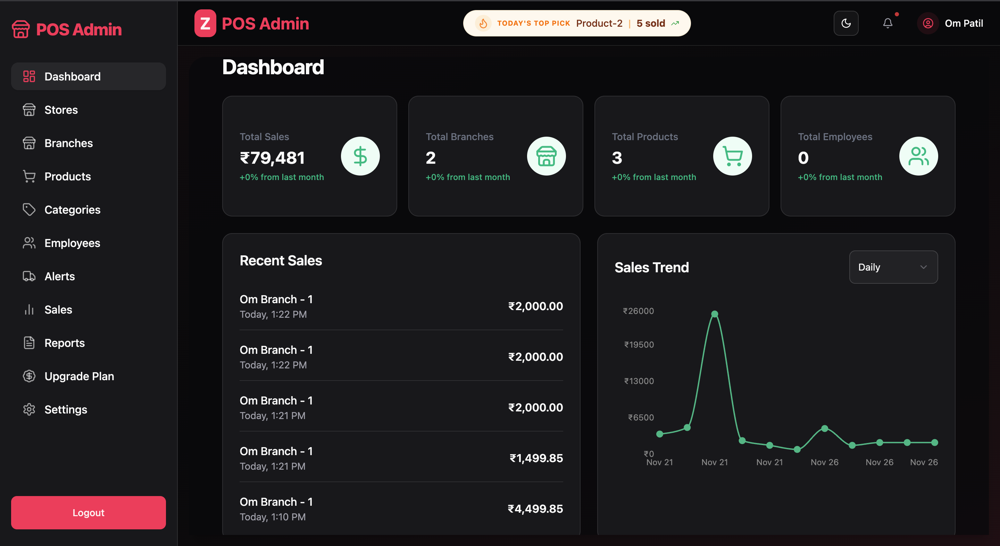
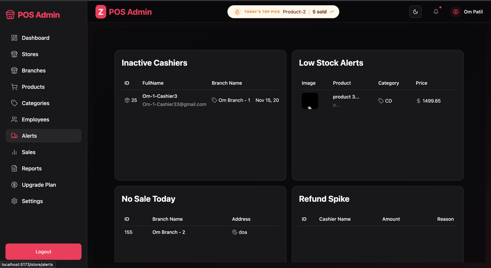

🛒 Advanced POS System (Shivam-POS)

A full-stack, enterprise-grade Point of Sale (POS) solution engineered for high-volume retail environments.

This application bridges the gap between complex inventory management and intuitive cashier operations. Built with a Spring Boot backend and a React (Vite) frontend, it features real-time analytics via WebSockets, secure RBAC authentication, and integrated payment gateways.

📸 Application Previews

🖥️ Advanced POS Terminal (Cashier Console)

Designed for high-speed transactions with a visual grid, keyboard shortcuts, and real-time cart management.

<table>
<tr>
<td width="50%" align="center">
<b>1. Main Cashier Console</b>

<i>Tech: React Virtualized Grid / Tailwind CSS</i>

</td>
<td width="50%" align="center">
<b>2. Customer Information</b>

<i>Tech: Debounced Search / Redux Slice</i>

</td>
</tr>
<tr>
<td align="center">
<b>3. Payment Options</b>

<i>Tech: Strategy Pattern / Payment Gateway Integration</i>

</td>
<td align="center">
<b>4. Card Payment Dialog</b>

<i>Tech: Razorpay Web SDK / Error Boundaries</i>

</td>
</tr>
<tr>
<td align="center">
<b>5. Transaction Success</b>

<i>Tech: Optimistic UI Updates</i>

</td>
<td align="center">
<b>6. Digital Order Invoice</b>

<i>Tech: jsPDF / React-to-Print Engine</i>

</td>
</tr>
<tr>
<td align="center">
<b>7. Return & Refund Processing</b>

<i>Tech: ACID Transactions / Spring Data JPA</i>

</td>
<td align="center">
<b>8. End of Shift Summary</b>

<i>Tech: Java Stream API / SQL Aggregation</i>

</td>
</tr>
</table>

🏢 Branch Manager Console

Centralized control for store operations, featuring real-time data streaming and role-based security.

<table>
<tr>
<td width="50%" align="center">
<b>1. Live Branch Dashboard</b>

<i>Tech: WebSockets / STOMP Protocol</i>

</td>
<td width="50%" align="center">
<b>2. Real-Time Orders Feed</b>

<i>Tech: React Hooks / Event Polling</i>

</td>
</tr>
<tr>
<td align="center">
<b>3. Inventory Control System</b>

<i>Tech: MySQL / Batch Processing</i>

</td>
<td align="center">
<b>4. Employee & RBAC Management</b>

<i>Tech: Spring Security / JWT Filters</i>

</td>
</tr>
<tr>
<td align="center" colspan="2">
<b>5. Sales Reports & Analytics</b>

<i>Tech: Recharts / Apache POI (Excel Export)</i>

</td>
</tr>
</table>

👑 Super Admin & Store Settings

Global configuration hub for managing multi-tenant settings, payments, and system-wide alerts.

<table>
<tr>
<td width="50%" align="center">
<b>1. Master Admin Dashboard</b>

<i>Tech: Data Aggregation / Performance Metrics</i>

</td>
<td width="50%" align="center">
<b>2. Global Sales Management</b>

<i>Tech: JPA Specifications / Advanced Filtering</i>

</td>
</tr>
<tr>
<td align="center">
<b>3. Store Configuration</b>

<i>Tech: React Hook Form / Zod Validation</i>

</td>
<td align="center">
<b>4. Workforce Administration</b>

<i>Tech: RBAC Hierarchies / Secure Password Hashing</i>

</td>
</tr>
<tr>
<td align="center">
<b>5. Payment Gateway Setup</b>

<i>Tech: AES Encryption / Environment Management</i>

</td>
<td align="center">
<b>6. System Alerts & Notifications</b>

<i>Tech: @Scheduled Tasks / Push Notifications</i>

</td>
</tr>
</table>

🚀 Key Features

1. 🖥️ Advanced POS Terminal (Cashier Console)

Optimized for speed and efficiency during peak hours.

Visual Product Grid: Responsive, card-based layout rendering images, prices, and SKUs using Tailwind CSS Grid.

Global Search & Shortcuts: Implemented Debouncing for instant product lookup and 'F1' keyboard shortcuts for barcode scanner emulation.

Smart Cart System: Managed via Redux Toolkit to handle real-time subtotal calculation, dynamic tax application, and instant quantity adjustments without re-renders.

Order Management:

Hold/Resume: "Park" transactions using Redux Persist (Local Storage) to serve multiple customers simultaneously.

Custom Items: Add non-inventory items (e.g., delivery fees) dynamically.

Discount Engine: Apply fixed (₹) or percentage (%) logic to cart totals.

2. 💳 Integrated Payments & Financials

Payment Gateways: Full integration with Razorpay Web SDK and Stripe for credit/debit/UPI transactions.

Digital Invoicing: Automated PDF generation using React-To-Print and jsPDF, creating professional receipts on the fly.

Dynamic Taxation: Tax rates are fetched from the backend based on branch-specific configurations (not hardcoded).

3. 👥 Customer Loyalty & CRM

Loyalty Engine: automated point accrual system tracked via Spring Data JPA.

Redemption Logic: Cashiers can instantly view point balances and apply redeemable value to current orders.

Customer Profiles: Detailed history tracking for personalized service.

4. 📊 Real-Time Admin & Analytics

Live Dashboard: Utilizes WebSockets (STOMP Protocol) to push sales updates to the admin dashboard instantly—no page refreshes required.

Trending Ticker: Live feed of top-selling products.

Visualizations: Interactive sales graphs (Daily/Weekly/Monthly) powered by Recharts and Chart.js.

Multi-Branch Architecture: Centralized control for managing inventory and sales across multiple physical store locations.

5. 📦 Inventory & Stock Control

Transactional Inventory: Stock is automatically deducted upon completed checkout (ACID compliant).

Low Stock Alerts: Visual UI indicators trigger when SKUs fall below defined thresholds.

Comprehensive CRUD: Full management of Cost Price, Selling Price, SKUs, and Categories.

6. 🔐 Security & Architecture

RBAC (Role-Based Access Control): Granular permission scopes for Super Admin, Branch Manager, and Cashier using Spring Security.

Stateless Authentication: Secure login system utilizing JWT (JSON Web Tokens) with interceptors for token validation.

Shift Lifecycle: Mandatory "Start Shift" / "End Shift" logic that generates session-specific sales reports, preventing unauthorized transactions.

Route Guards: Frontend protection via React Router to prevent unauthorized URL access.

7. 📑 Reporting & Data Export

Excel Export: Built with Apache POI to download comprehensive transaction history for external accounting.

Shift Reconciliation: Automated reports comparing system totals vs. collected cash.

8. 🎨 UI/UX Design

Glassmorphism: Modern aesthetic utilizing translucent panels, backdrop filters, and gradients via Tailwind CSS.

Theming: Global Dark/Light mode toggle.

Responsive: Fully optimized for Tablets (POS usage) and Desktops (Admin usage).

🛠️ Tech Stack

Frontend

Framework: React.js (Vite Build Tool)

State Management: Redux Toolkit, Redux Persist

Styling: Tailwind CSS, PostCSS

Visualization: Recharts, Chart.js

Utilities: Axios (Interceptors), Lodash, Day.js

Backend

Framework: Java 17, Spring Boot 3.x

Database: MySQL (Relational Data Modeling)

ORM: Hibernate / Spring Data JPA

Security: Spring Security, JWT

Real-time: WebSocket (Spring Messaging)

Tools: Lombok, Apache POI (Excel), Razorpay/Stripe Java SDKs

⚙️ Installation & Setup

Prerequisites

Node.js & npm

Java JDK 17+

MySQL Server

1. Clone the Repository

git clone [https://github.com/ShivaScripts/ADVANCED-POS-SYSTEM.git](https://github.com/ShivaScripts/ADVANCED-POS-SYSTEM.git)
cd ADVANCED-POS-SYSTEM

2. Backend Setup

Configure your MySQL database name as pos_temp.

Set the following environment variables in your IDE or OS (Do not hardcode these):

DB_USERNAME, DB_PASSWORD

MAIL_USERNAME, MAIL_PASSWORD (For SMTP)

RAZORPAY_KEY_ID, RAZORPAY_KEY_SECRET

Run the Spring Boot application:

mvn spring-boot:run

3. Frontend Setup

Install dependencies:

npm install

Start the development server:

npm run dev

Access the app at http://localhost:5173.

📂 Project Structure

ADVANCED-POS-SYSTEM/
├── src/main/java/com/zosh  # Spring Boot Backend Controllers, Services, Entities
├── src/components          # React Reusable Components
├── src/redux               # Redux Slices (Cart, Auth, Theme)
├── src/pages               # Page Views (POS, Dashboard, Inventory)
└── Dockerfile              # Containerization Config

🤝 Contact

Shivam - GitHub Profile
